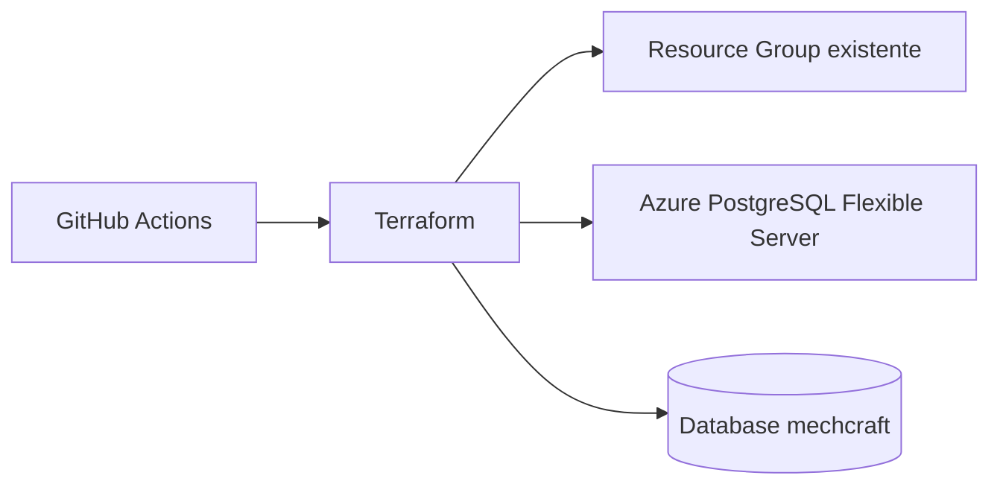

# Arquitetura Da Infraestrutura De Banco

```mermaid
flowchart LR
  GitHubActions[GitHub Actions] --> Terraform[Terraform]
  Terraform --> RG[Resource Group existente]
  Terraform --> PG[Azure PostgreSQL Flexible Server]
  Terraform --> DB[(Database mechcraft)]
```

## Escopo

- Provisionar o banco gerenciado.
- Criar a database da aplicacao.
- Expor outputs consumidos por CI/CD e pela aplicacao.
